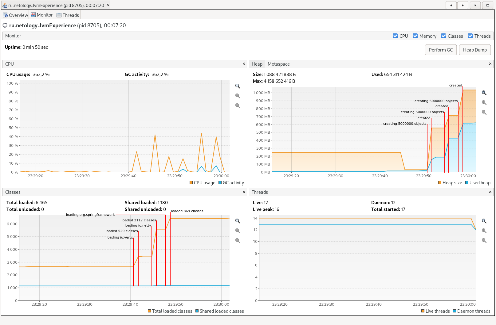
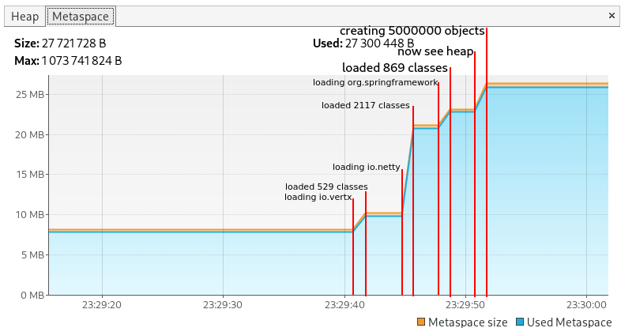

# Задание 1

ClassLoader'ы отрабатывают до запуска метода main. В данном случае им надо загрузить только классы JvmComprehension, Integer, Object и всё, что используется при вызовах System.out.println(). Object вообще, скорее всего, по дефолту загружен всегда, т. к. является неявным предком любого класса, а значит и используется во всех программах. Статические данные классов сохраняется в Metaspace, отдельно от кучи и стека основной программы.

1. на стэке выделяется 4 байта, туда записывается 00000000000000000000000000000001

2. в куче выделяется память под объект класса Object, нв стэке выделяется память для хранения адреса этого объекта, в стэке создаётся фрейм для вызова конструктора и локальные переменные конструктора, отрабатывает конструктор, после чего фрейм удаляется (FIFO)

3. в куче выделяется память под объект класса Integer, туда так или иначе записывается 00000000000000000000000000000010 (не знаю, есть ли у Integer какой-нибудь неявный конструктор), на стэке выделяется память для хранения адреса этого объекта в куче

4. на стэке создаётся фрейм для вызова метода printAll, там также будут храниться аргументы и локальные переменные этого метода, после чего в память, выделенную под аргументы, копируются значения этих аргументов и происходит вызов printAll, после завершения работы функции выделенный под неё фрейм удаляется

5. в куче выделяется память под объект класса Integer, туда так или иначе записывается 00000000000000000000001010111100 (700) (не знаю, есть ли у Integer какой-нибудь неявный конструктор), на стэке выделяется память для хранения адреса этого объекта в куче

6. аналогично вызову любой другой функции (с выделением фреймов в стэке, передачей параметров, последующим копированием возвращённого значения в текущий фрейм и удалением этих фреймов) сначала вызывается метод o.toString(), затем одна за другой происходят две операции конкатенации (по идее, неявная сериализация числа в строку тоже представляет из себя вызов функции, но мне кажется, что оно должно происходить в той же функции, что и, собственно, конкатенация), далее происходит вызов println

7. аналогично вызову любой другой функции (с выделением фрейма в стэке, передачей параметров и удалением этих фрейма после завершения работы) вызывается System.out.println(), в параметры передаётся ссылка на строку из StringPool

Когда сработает "Stop the world" предугадать по этому коду невозможно, но он довольно быстро выполнится и, исходя из этого, я предполагаю, что этого не произойдёт вовсе, а сборщик мусора начнёт свою работу уже после завершения работы метода main(). Если бы сработал "Stop the world", происходила бы пометка объектов на основании графа ссылок и последующая их очистка из кучи, однако, т. к. main() завершился, я полагаю, что сборщик мусора просто очистит все объекты из кучи.

# Задание 2

## Classes и heap

На графике "classes" отображено количество загруженных классов, оно увеличивается при обращении к классам библиотек.

На графике "heap" отображается занятая память в куче. Заметно, как она увеличивается при создании объектов и сохранении их в коллекцию.

## Metaspace

На этом графике отражается размер размер так называемого mataspace. Там сохраняются статические данные, относящиеся к классам. Последняя ступенька не соотносится по времени ни с одной из загрузок библиотек, поэтому я предположил, что она отображает загрузку каких-либо классов при работе следующего этапа программы. Например, компонентов коллекции ArrayList.

